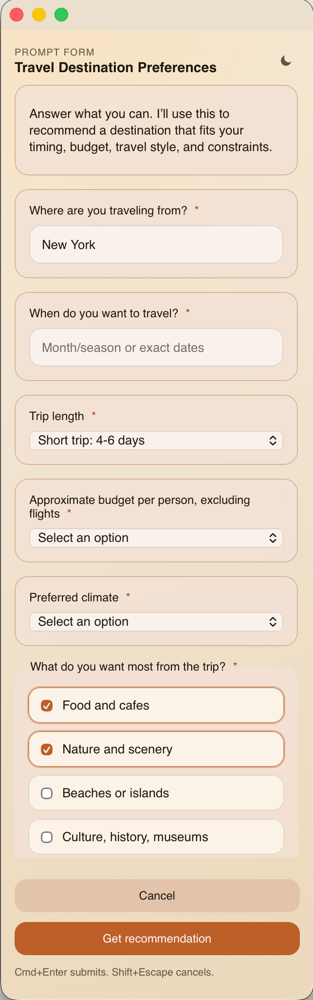

# prompt-gui-mcp

`prompt-gui-mcp` lets AI coding agents ask for your input through beautiful, interactive GUI forms instead of plain text prompts.

Instead of forcing an agent to guess, stall, or ask you in chat, the agent can call an MCP tool that opens a macOS desktop prompt. You answer in the app, and the result goes back to the agent as structured data.

For example, send this prompt to your agent:

```text
Use prompt-gui-mcp to show me a form with questions that will help you recommend a travel destination. Ask about my preferences, travel season, budget, trip style, and any other details you need.
```

opens a desktop form like this:



## What It Does

- Shows flexible forms generated from an MCP tool call.
- Agents can compose forms with elements such as text, textarea, radio, select, checkbox-list, markdown, and image fields.
- Returns the user's validated answers to the calling agent.
- Keeps the prompt in a small always-on-top desktop window.
- Includes a follow-up wait tool so agents can continue waiting when a prompt takes longer than their normal tool timeout.

The current MCP tools are:

| Tool | Purpose |
| --- | --- |
| `prompt-form` | Show a structured form and return submitted values plus optional feedback. |
| `wait-for-prompt` | Continue waiting for a pending prompt by UUID. |

## Download

Only the macOS app is packaged right now.

1. Open the [GitHub Releases page](https://github.com/royhcj/i-am-mcp/releases).
2. Download the latest macOS `.dmg` or `.zip` asset.
3. Install and launch `prompt-gui-mcp`.
4. Keep the app running while your coding agent uses the MCP server.

The mac app starts the local backend sidecar automatically. By default, the MCP endpoint is:

```text
http://127.0.0.1:43118/mcp
```

## Set Up Your Coding Agent

Configure any MCP client that supports Streamable HTTP to connect to the local server:

```json
{
  "mcpServers": {
    "prompt-gui-mcp": {
      "url": "http://127.0.0.1:43118/mcp"
    }
  }
}
```

Then restart the agent or reload its MCP servers. The desktop app must be running before the agent calls `prompt-form`.

Some agents use a TOML-style MCP config instead:

```toml
[mcp_servers.prompt-gui-mcp]
url = "http://127.0.0.1:43118/mcp"
```

After setup, ask the agent to use `prompt-gui-mcp` when it needs your input. For example:

```text
Use prompt-gui-mcp to show me a form before choosing the deployment strategy. Ask for the target environment, risk tolerance, rollback preference, and approval notes.
```

## Build And Run The Packaged App

Requirements:

- Node.js 22+
- pnpm 10+
- Rust toolchain
- Xcode Command Line Tools on macOS

Install dependencies:

```bash
pnpm install
```

Build the packaged desktop app:

```bash
pnpm --filter desktop tauri:build
```

Open the generated app bundle:

```bash
open apps/desktop/src-tauri/target/release/bundle/macos/prompt-gui-mcp.app
```

The `.app`, `.dmg`, and `.zip` outputs are written under:

```text
apps/desktop/src-tauri/target/release/bundle/
```

## Development Checks

```bash
pnpm --filter backend check
pnpm --filter desktop check
pnpm simulate
```

`pnpm simulate` starts the desktop app and sends a sample MCP tool call so you can test the full prompt flow.

## Architecture

```text
Coding agent -> MCP HTTP endpoint -> backend queue -> desktop app -> human
                                                 ^                    |
                                                 |--------------------|
```

- `apps/backend` is the Node.js MCP server and local HTTP API.
- `apps/desktop` is the Svelte frontend and Tauri v2 macOS shell.
- The backend listens on `127.0.0.1:43118` unless `I_AM_MCP_SERVER_PORT` is set.
- The desktop app reads backend state over local HTTP/SSE and submits completed form results back to the backend.

## Repository

```text
apps/backend   MCP server, task queue, local HTTP/SSE API
apps/desktop   Svelte UI and Tauri desktop shell
docs           Design notes, packaging notes, and README assets
```

Contributions are welcome. Keep changes focused, run the checks above, and open a pull request with a clear description.
