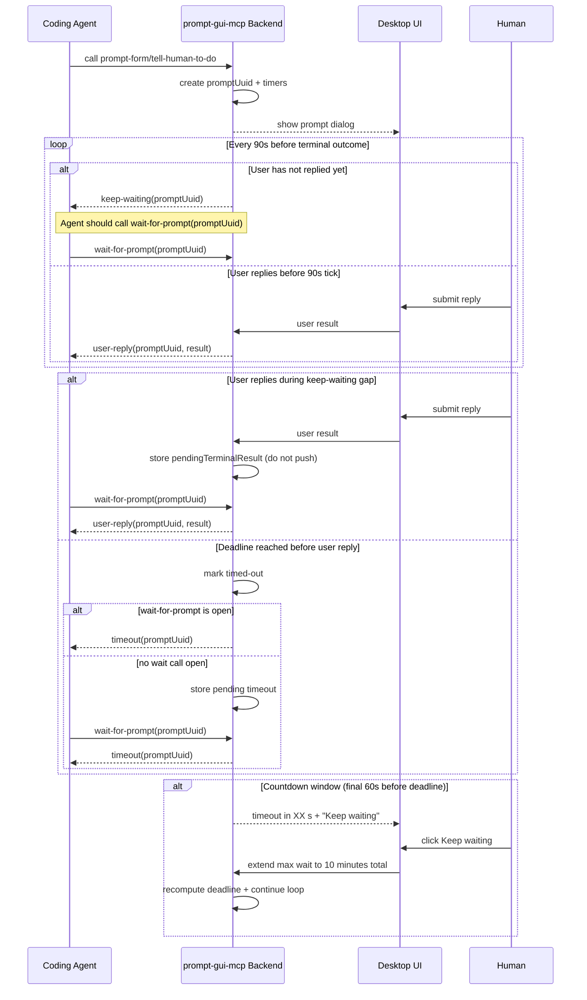

# Prompt Wait Timeout and Keep-Waiting Spec

## 1. Goal

Make `prompt-gui-mcp` resilient when the coding agent does not keep one tool call open for a long time.

New behavior:
- do not block forever on the initial tool call
- return periodic `keep-waiting` responses every 90 seconds while waiting for user input
- require the coding agent to call `wait-for-prompt` with a prompt UUID to continue waiting
- stop waiting at a max wait deadline (default 5 minutes)
- show a UI countdown in the final 60 seconds before timeout
- allow one user-triggered extension to 10 minutes total

## 2. Scope

Applies to human-interaction MCP tools that wait for a dialog response:
- `tell-human-to-do`
- `prompt-form`

This spec adds a new MCP tool:
- `wait-for-prompt`

## 3. Terms

- `promptUuid`: UUID assigned when a human prompt task is created.
- `keep-waiting`: non-terminal response telling the coding agent to call `wait-for-prompt`.
- `timeout`: terminal response when max waiting time is reached.
- `user-reply`: terminal response carrying actual human input (`completed`/`failed`, or `submitted`/`cancelled`).
- `deadline`: absolute timeout timestamp for this prompt (`createdAt + maxWaitMs`).

## 4. Timing Rules

Default constants:
- `KEEP_WAITING_INTERVAL_MS = 90_000`
- `DEFAULT_MAX_WAIT_MS = 300_000` (5 minutes)
- `EXTENDED_MAX_WAIT_MS = 600_000` (10 minutes total from creation)
- `COUNTDOWN_START_BEFORE_DEADLINE_MS = 60_000`

Behavior:
- Start timers when prompt is created.
- If user has not replied after 90 seconds, return `keep-waiting` on the currently open wait call.
- Continue every 90 seconds until a terminal outcome (`user-reply` or `timeout`).
- At deadline, return `timeout` (terminal).

## 5. MCP Contract

## 5.1 Prompt-Creating Tools (`tell-human-to-do`, `prompt-form`)

When called, each tool now returns one of:
- terminal `user-reply` (if user replied quickly)
- non-terminal `keep-waiting`
- terminal `timeout` (only if deadline reached before the first response could be returned)

Each response must include `promptUuid`.

Example `keep-waiting` payload:

```json
{
  "type": "keep-waiting",
  "promptUuid": "a7f1f2a2-04dc-449f-91d8-6862462bdd87",
  "message": "The user is still working on this prompt. Call 'wait-for-prompt' with this promptUuid to continue waiting.",
  "nextRecommendedWaitMs": 90000,
  "elapsedMs": 90000,
  "remainingMs": 210000
}
```

## 5.2 New Tool: `wait-for-prompt`

Input:

```json
{
  "promptUuid": "string (uuid)"
}
```

Output union:
- `keep-waiting` (non-terminal)
- `timeout` (terminal)
- tool-specific `user-reply` (terminal)

Example `timeout` payload:

```json
{
  "type": "timeout",
  "promptUuid": "a7f1f2a2-04dc-449f-91d8-6862462bdd87",
  "message": "Timed out waiting for user response.",
  "elapsedMs": 300000,
  "maxWaitMs": 300000
}
```

## 6. Gap Rule (Critical)

There is a gap between:
1. backend returning `keep-waiting`, and
2. coding agent calling `wait-for-prompt`.

Required behavior during this gap:
- If user replies during the gap, backend must **store** the reply and mark it pending delivery.
- Backend must **not** send that reply to the original prompt-creating call (it is already resolved).
- Backend must deliver the stored reply only when `wait-for-prompt(promptUuid)` is called.
- Same rule applies to timeout if deadline is reached while no wait call is open.

## 7. Backend State Model

Per prompt, backend keeps:
- `promptUuid`
- `createdAt`
- `maxWaitMs` (300000 default, 600000 after extension)
- `deadlineAt`
- `nextKeepWaitingAt`
- `status`: `waiting-user` | `waiting-agent` | `completed` | `timed-out`
- `pendingTerminalResult` (optional; stored `user-reply` or `timeout` for next `wait-for-prompt`)
- `extensionUsed` (boolean)

Notes:
- `waiting-agent` means no wait call is currently open; backend is waiting for `wait-for-prompt`.
- At most one outstanding waiter per `promptUuid` is allowed.

## 8. Frontend Countdown and Extend Action

Countdown UI requirement:
- When now >= `deadlineAt - 60s`, show small text at the bottom:
- `timeout in XX s`
- `XX` updates every second and clamps at `0`.

Extend action:
- Show a text button with underline on the right side of the countdown: `Keep waiting`.
- The button appears only while countdown is visible and before timeout.
- On click/tap:
  - set `maxWaitMs = 600000` total from creation time
  - recompute `deadlineAt`
  - hide button if `extensionUsed = true`

After extension:
- keep-waiting loop continues with same 90-second interval.
- countdown appears again in the final 60 seconds before the new deadline.

## 9. Sequence Diagram



## 10. Error Handling

- `wait-for-prompt` with unknown `promptUuid`: return `not-found` error.
- `wait-for-prompt` for terminal and already-consumed prompt: return `already-resolved` error.
- Multiple concurrent `wait-for-prompt` calls for same prompt: reject second call with `conflict` error.
- Invalid UUID format: validation error.

## 11. Coding Agent Requirement on Timeout

When the coding agent receives a `timeout` response for a `promptUuid`, it must:
- stop calling `wait-for-prompt` for that `promptUuid`
- treat that prompt as closed
- continue its task flow without waiting for further human input from that prompt

## 12. Acceptance Criteria

- Prompt gets a UUID at creation and UUID is returned in all related responses.
- If no user reply for 90 seconds, agent receives `keep-waiting`.
- Agent can continue by calling `wait-for-prompt(promptUuid)` repeatedly.
- If user replies during the gap, result is held and returned on the next `wait-for-prompt`.
- System stops waiting at 5 minutes by default and returns `timeout`.
- After receiving `timeout`, the coding agent gives up waiting for that prompt and keeps working.
- Countdown (`timeout in XX s`) appears in the final 60 seconds.
- `Keep waiting` appears next to countdown, extends deadline to 10 minutes total, and can be used once.
- Keep-waiting loop continues correctly after extension.
