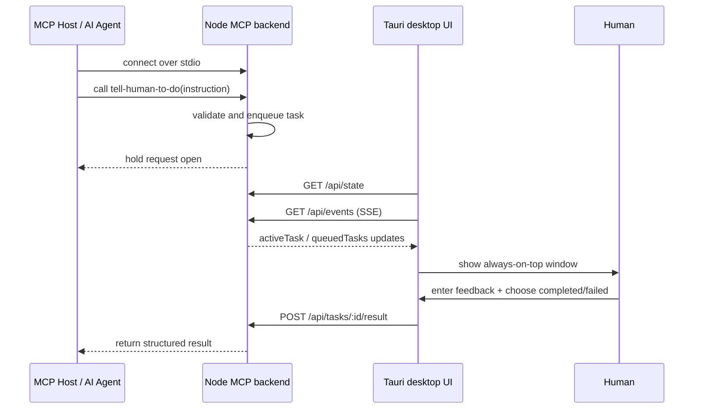

# i-am-mcp Workflow

This document explains how the app is supposed to run and how the pieces talk to each other.

## 1. Components

- `MCP Host`: the AI coding agent or tool runner that calls the MCP tool
- `apps/backend`: the Node.js MCP server
- `apps/desktop`: the Tauri desktop app with the human-facing UI
- `User`: the human who completes the requested action

## 2. Runtime Roles

### 2.1 Backend

The backend is the MCP server process.

- It exposes the MCP tool `tell-human-to-do`
- It keeps task state in memory
- It exposes a local HTTP control API for the desktop UI
- It uses stdio for MCP communication

### 2.2 Desktop App

The desktop app is the UI shell.

- It shows the active task
- It stays always on top
- It lets the user submit `completed` or `failed`
- It sends the user response back to the backend over HTTP

### 2.3 Relationship

- The backend does not depend on the desktop UI to accept MCP calls
- The desktop UI depends on the backend to show state and submit results
- In the current code, the desktop app is not yet spawning the backend as a sidecar
- The docs and structure suggest that sidecar lifecycle is the intended target architecture

## 3. Launch Flow

There are two distinct startup concerns:

1. Starting the MCP backend process
2. Starting the desktop UI process

### 3.1 MCP Start

When an MCP host wants to use `tell-human-to-do`, it must first start the backend as a live process and connect to it over stdio.

### 3.2 Desktop Start

The desktop app may be launched:

- manually by the user
- by a helper script during development
- by Tauri as a sidecar-driven app in the intended final design

## 4. Task Flow

1. The MCP host calls `tell-human-to-do(instruction)`.
2. The backend validates the input.
3. The backend enqueues the task and keeps the MCP call pending.
4. The desktop UI connects to the backend control API.
5. The backend pushes task state updates to the desktop UI.
6. The desktop UI shows the instruction to the user.
7. The user enters feedback and chooses `completed` or `failed`.
8. The desktop UI posts the result back to the backend.
9. The backend resolves the original MCP request with `status + feedback`.

## 5. Sequence Diagram

## 6. Important Behavior Notes

- Stdio means the backend must already be running before the MCP tool call can happen
- The desktop UI can reconnect independently, but it cannot receive task data unless the backend is alive
- The backend is the source of truth for task state
- The desktop is only a presentation and submission layer

## 7. Current Implementation Notes

- `pnpm simulate` starts the desktop app first and then runs backend simulation
- `apps/backend/src/index.ts` starts the stdio MCP server and the local HTTP control server
- `apps/desktop/src/lib/api.ts` uses `http://127.0.0.1:43118` for state and result submission
- `apps/desktop/src-tauri/src/main.rs` currently handles window behavior only

## 8. Target Direction

The intended production shape is:

- Tauri owns the desktop window lifecycle
- Tauri also launches and supervises the Node backend as a sidecar
- The MCP host talks to the backend through stdio
- The backend updates the desktop UI through local control APIs

